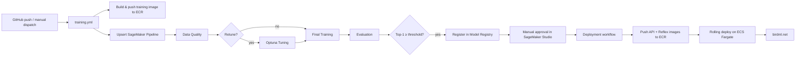
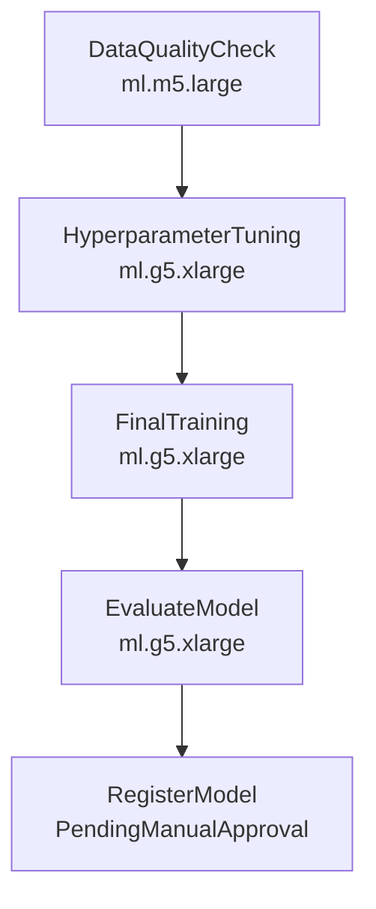

# BirdML — End-to-End Bird Species Classifier

> Production-grade MLOps pipeline that ingests, validates, tunes, trains, evaluates, registers, and deploys an EfficientNet-B3 image classifier across 526 bird species — entirely on AWS, triggered from GitHub.

**🌐 Live demo:** [birdml.net](https://birdml.net)

[](.github/workflows/training.yml)
[](.github/workflows/deployment.yml)
[](pyproject.toml)
[](LICENSE)


---

## Table of Contents

1. [Overview](#overview)
2. [Tech Stack](#tech-stack)
3. [Repository Structure](#repository-structure)
4. [Dataset and Model](#dataset-and-model)
5. [AWS Prerequisites and Setup](#aws-prerequisites-and-setup)
6. [Local Development Setup](#local-development-setup)
7. [ML Pipeline — Component Reference](#ml-pipeline--component-reference)
8. [SageMaker Pipeline](#sagemaker-pipeline)
9. [Inference Services](#inference-services)
10. [CI/CD Workflows](#cicd-workflows)
11. [Configuration Reference](#configuration-reference)
12. [Experiment Tracking](#experiment-tracking)
13. [Known Limitations](#known-limitations)
14. [License](#license)

---

## Overview

BirdML is an end-to-end image-classification system covering every stage of the ML lifecycle. Pushing to `master` re-upserts a SageMaker Pipeline that, when triggered, validates data, optionally re-tunes hyperparameters with Optuna, trains an EfficientNet-B3 on ~90k bird images, evaluates against a held-out test set, and registers the model in SageMaker Model Registry with a manual approval gate. Once approved, a deployment workflow rolls out new FastAPI and Reflex containers to ECS Fargate behind an Application Load Balancer.

**Headline metrics on the held-out test set** (produced by the evaluation step in [run_evaluate.py](infrastructure/sagemaker/scripts/run_evaluate.py)):

| Metric | Value |
|---|---|
| Top-1 accuracy | **99.52%** |
| Top-5 accuracy | **99.96%** |
| Cross-entropy loss | 0.0263 |

To reproduce, build the training image and run the evaluation script — see [How to fetch reported accuracy](#how-to-fetch-reported-accuracy).



---

## Tech Stack

| Concern | Choice |
|---|---|
| Framework | PyTorch + torchvision (EfficientNet-B3) |
| Hyperparameter tuning | Optuna |
| Experiment tracking | MLflow (local logs synced to S3 — no hosted tracking server) |
| Pipeline orchestration | SageMaker Pipelines |
| Compute (training) | SageMaker Processing Jobs, `ml.g5.xlarge` GPU |
| Model registry | SageMaker Model Registry (manual approval) |
| Container registry | Amazon ECR |
| Inference API | FastAPI on ECS Fargate |
| Frontend | Reflex (Python-native React) + Caddy reverse proxy on ECS Fargate |
| Load balancing | AWS Application Load Balancer |
| CI/CD | GitHub Actions |
| Package management | `uv` |

---

## Repository Structure

```
Bird ML/
├── src/bird_classifier/             # core ML library (imported by all entry points)
│   ├── config.py                    # S3 paths, dataset constants, hyperparameter catalog
│   ├── data/
│   │   ├── ingestion.py             # HuggingFace → S3 parquet sync
│   │   ├── quality.py               # data quality checks
│   │   ├── transforms.py            # train/eval image transforms
│   │   ├── dataset.py               # BirdDataset + label remap
│   │   └── dataloaders.py           # DataLoader factory
│   ├── training/
│   │   ├── model.py                 # EfficientNet-B3 builder, checkpoint loader
│   │   ├── engine.py                # run_epoch, top-k accuracy
│   │   ├── tune.py                  # Optuna search entry point
│   │   └── train.py                 # final training entry point
│   ├── evaluation/
│   │   ├── metrics.py               # accuracy helpers
│   │   └── evaluate.py              # test-set evaluation entry point
│   └── inference/
│       └── predict.py               # single-image preprocessing + top-k prediction
├── infrastructure/
│   ├── docker/
│   │   └── Dockerfile.training      # GPU image used by all SageMaker steps
│   └── sagemaker/
│       ├── pipeline.py              # Pipeline definition (5 steps, 5 parameters)
│       ├── local_test.py            # local SDK testing wrapper
│       └── scripts/                 # one entry point per pipeline step
│           ├── run_quality_check.py
│           ├── run_tune.py
│           ├── run_train.py
│           ├── run_evaluate.py
│           └── _s3_utils.py
├── api/
│   ├── main.py                      # FastAPI app, /predict + /health
│   ├── Dockerfile                   # CPU image, pulls model from S3 at startup
│   └── requirements.txt
├── reflex_app/                      # canonical frontend (birdml.net)
│   ├── reflex_app/                  # Reflex app code (pages, state, styles)
│   ├── assets/species_data/         # per-species JSON metadata (525 files)
│   ├── Caddyfile                    # reverse proxy: /_event → :8001, rest → :3001
│   ├── entrypoint.sh                # starts Caddy + Reflex backend + frontend
│   ├── Dockerfile
│   └── rxconfig.py                  # Reflex config + backend URL
├── .github/workflows/
│   ├── training.yml                 # SageMaker Pipeline trigger
│   └── deployment.yml               # ECS Fargate rolling deploy
├── notebooks/                       # exploration / prototyping
├── pyproject.toml                   # uv-managed deps (custom PyTorch CUDA index)
└── README.md
```

---

## Dataset and Model

**Dataset.** [`yashikota/birds-525-species-image-classification`](https://huggingface.co/datasets/yashikota/birds-525-species-image-classification) — ~90k images, 526 unique classes (525 advertised + one extra discovered in val/test), pre-split into train/val/test, all 224×224 RGB. Stored as parquet at `s3://bird-ml-halajeel/data/raw/birds-525/`.

**Model.** EfficientNet-B3 (ImageNet pretrained) with a fresh 526-class linear head. Fine-tuned in two stages:

1. **Warmup** — backbone frozen, only the new head trains. Lets the head reach a reasonable loss before backpropagating gradients into pretrained features.
2. **Fine-tune** — entire network unfrozen. Two parameter groups: a high learning rate for the new head, a low rate for the pretrained backbone — keeps the pretrained representations stable while still adapting them to birds.

The full search space catalog, when-not-tuned defaults, and current best params are in [src/bird_classifier/config.py](src/bird_classifier/config.py).

### How to fetch reported accuracy

To populate the headline metrics, build the training image and run the evaluation step locally or via the pipeline:

```bash
# Build the training container
docker build -f infrastructure/docker/Dockerfile.training -t bird-ml-training:latest .

# Run evaluation against the model currently in S3
docker run --rm --gpus all \
    -e AWS_ACCESS_KEY_ID -e AWS_SECRET_ACCESS_KEY -e AWS_REGION \
    bird-ml-training:latest python infrastructure/sagemaker/scripts/run_evaluate.py
```

Output metrics JSON is uploaded to `s3://bird-ml-halajeel/reports/`.

---

## AWS Prerequisites and Setup

The pipeline assumes the following AWS resources exist in the target account / region. Replace `<ACCOUNT_ID>`, `<REGION>`, and `<BUCKET>` with your values. **Before first run**, also update the two hardcoded values in [src/bird_classifier/config.py](src/bird_classifier/config.py) (`AWS_ACCOUNT_ID`, `S3_BUCKET`) and the role suffix in [infrastructure/sagemaker/pipeline.py:27](infrastructure/sagemaker/pipeline.py#L27).

### 1. S3 bucket

```bash
aws s3 mb s3://<BUCKET> --region <REGION>
```

Prefixes used (auto-created on first write):

| Prefix | Purpose |
|---|---|
| `data/raw/birds-525/` | Source dataset (parquet) |
| `params/best_params.json` | Output of Optuna tuning step |
| `models/EN_final.pth` | Final model checkpoint |
| `models/class_names.json` | Label index → species name |
| `mlruns/` | MLflow run logs synced from training jobs |
| `reports/` | Evaluation metrics, confusion matrix, quality reports |

### 2. SageMaker execution role

Create an IAM role with this trust policy:

```json
{
  "Version": "2012-10-17",
  "Statement": [{
    "Effect": "Allow",
    "Principal": { "Service": "sagemaker.amazonaws.com" },
    "Action": "sts:AssumeRole"
  }]
}
```

Attach managed policies:
- `AmazonSageMakerFullAccess`
- `AmazonS3FullAccess` (or a scoped policy granting `s3:*` on `arn:aws:s3:::<BUCKET>/*`)
- `AmazonEC2ContainerRegistryReadOnly`

Then copy the role ARN into [infrastructure/sagemaker/pipeline.py:27](infrastructure/sagemaker/pipeline.py#L27).

### 3. ECR repositories

```bash
aws ecr create-repository --repository-name bird-ml-training --region <REGION>
aws ecr create-repository --repository-name bird-ml-api      --region <REGION>
aws ecr create-repository --repository-name bird-ml-frontend --region <REGION>
```

### 4. ECS Fargate cluster + services

```bash
aws ecs create-cluster --cluster-name bird-ml-cluster --region <REGION>
```

Then create two services named `bird-ml-api` and `bird-ml-frontend` (the deployment workflow calls `aws ecs update-service` with these exact names — see [deployment.yml](.github/workflows/deployment.yml)). Each service needs:

- A Fargate task definition pointing at the matching ECR image (`bird-ml-api:latest` / `bird-ml-frontend:latest`)
- Task role with `AmazonS3ReadOnlyAccess` (API needs to download the model from S3 at startup — see [api/main.py:39-40](api/main.py#L39-L40))
- The API task needs port 8000 exposed; the Reflex task needs port 3000
- A target group per service, attached to an Application Load Balancer
- The ALB routes `/api/*` to the API target group and everything else to the frontend target group

A custom domain (e.g., `birdml.net`) is set up by pointing a Route 53 alias at the ALB.

### 5. GitHub Actions secrets

In the repo's **Settings → Secrets and variables → Actions**, add:

| Secret | Used in |
|---|---|
| `AWS_ACCESS_KEY_ID` | both workflows |
| `AWS_SECRET_ACCESS_KEY` | both workflows |

`AWS_REGION` is set as an `env:` value in each workflow file and currently hardcoded to `us-east-2` — edit both `.yml` files if you deploy elsewhere.

### 6. GPU quota

SageMaker's `ml.g5.xlarge` instance is not available by default on new AWS accounts — request a quota increase via **Service Quotas → SageMaker → `ml.g5.xlarge for training job usage`** before triggering a non-smoke-test run. For smoke testing without GPU quota, dispatch `training.yml` with `smoke_test=true` (the pipeline rebuilds itself on `ml.m5.xlarge`).

---

## Local Development Setup

Prerequisites: Python 3.11+, [`uv`](https://docs.astral.sh/uv/), Docker, AWS CLI configured.

```bash
git clone <your-fork-url>
cd "Bird ML"
uv sync --extra torch --extra dev
```

`pyproject.toml` declares a custom PyTorch CUDA 12.8 index ([pyproject.toml:34-41](pyproject.toml#L34-L41)). On CPU-only machines, replace the index URL with `https://download.pytorch.org/whl/cpu`.

To work in notebooks under [notebooks/](notebooks/):

```bash
uv run jupyter lab
```

To run the API locally against a checkpoint already in S3:

```bash
uv run uvicorn api.main:app --reload --port 8000
```

The API will download `EN_final.pth` and `class_names.json` from S3 on startup ([api/main.py:36-50](api/main.py#L36-L50)).

---

## ML Pipeline — Component Reference

Each component below maps to a module in `src/bird_classifier/`. Pipeline step scripts under [infrastructure/sagemaker/scripts/](infrastructure/sagemaker/scripts/) are thin wrappers that import these.

### Data ingestion — [src/bird_classifier/data/ingestion.py](src/bird_classifier/data/ingestion.py)

Pulls the HuggingFace parquet dataset and syncs it into `s3://<BUCKET>/data/raw/birds-525/`. Idempotent — subsequent runs detect the existing S3 dataset and skip re-download.

### Data quality — [src/bird_classifier/data/quality.py](src/bird_classifier/data/quality.py)

Three checks, all run in [run_quality_check.py](infrastructure/sagemaker/scripts/run_quality_check.py):

1. **Class count** — fails if the discovered unique class count ≠ `NUM_CLASSES` (526).
2. **Class outliers** — flags any class whose sample count is more than `CLASS_OUTLIER_STD_THRESHOLD` (3σ) from the mean. Logged, not fatal.
3. **Image validity** — every image must open as RGB without errors.

A JSON report is uploaded to `s3://<BUCKET>/reports/`. The step exits non-zero on fatal failures, halting the pipeline.

### Transforms — [src/bird_classifier/data/transforms.py](src/bird_classifier/data/transforms.py)

- **Train:** `RandomResizedCrop(224, scale=(0.8, 1.0))`, `RandomHorizontalFlip`, `ColorJitter(brightness=0.2, contrast=0.2)`, ImageNet normalization.
- **Eval:** `Resize(256)`, `CenterCrop(224)`, ImageNet normalization.

ImageNet mean / std are required because the EfficientNet-B3 backbone was pretrained against them ([config.py:34-35](src/bird_classifier/config.py#L34-L35)).

### Dataset & DataLoader — [dataset.py](src/bird_classifier/data/dataset.py), [dataloaders.py](src/bird_classifier/data/dataloaders.py)

`BirdDataset` wraps the parquet rows and decodes images on `__getitem__`. Sparse HuggingFace label IDs are remapped to a dense `[0, 525]` range; the inverse map is persisted to `class_names.json` and shipped alongside the model so inference can recover species names.

### Model builder — [src/bird_classifier/training/model.py](src/bird_classifier/training/model.py)

Loads pretrained EfficientNet-B3 weights from `s3://<BUCKET>/models/efficientnet_b3_rwightman-b3899882.pth` (bundled to avoid relying on torchvision's download endpoint inside SageMaker jobs). Replaces the final classifier with `nn.Linear(in_features, 526)`. Exposes `get_device()` (CUDA / MPS / CPU) and `load_checkpoint(path)`.

### Training engine — [src/bird_classifier/training/engine.py](src/bird_classifier/training/engine.py)

`run_epoch(model, loader, optimizer=None, ...)` — one pass through a DataLoader. If `optimizer` is `None`, runs in eval mode. Returns loss + top-1 / top-5 accuracy via `top_k_accuracy()`.

### Hyperparameter tuning — [src/bird_classifier/training/tune.py](src/bird_classifier/training/tune.py)

Optuna-driven search. The pipeline parameter `TuneParams` (comma-separated string) selects **which** hyperparameters are actually sampled; everything else falls back to `DEFAULT_HYPERPARAMS`.

| Parameter | Search range | Default (when not tuned) |
|---|---|---|
| `lr_head` | 1e-4 to 1e-2 (log) | 1e-3 |
| `lr_backbone` | 1e-5 to 1e-3 (log) | 1e-4 |
| `n_warmup_epochs` | 1 to 5 (int) | 3 |
| `n_finetune_epochs` | 5 to 15 (int) | 12 |
| `batch_size` | choices `[128]` | 128 |
| `weight_decay` | 1e-6 to 1e-3 (log) | 1e-5 |
| `optimizer` | choices `[RMSprop, Adam, AdamW, SGD]` | RMSprop |
| `scheduler` | choices `[StepLR, CosineAnnealingLR]` | StepLR |

Every trial is logged to MLflow. The best params are written to `s3://<BUCKET>/params/best_params.json`. The tuning step exits early without running any trials if `RetuneHyperparameters=false`.

### Final training — [src/bird_classifier/training/train.py](src/bird_classifier/training/train.py)

Reads `best_params.json` from S3 (falls back to the hardcoded `BEST_PARAMS` in [config.py](src/bird_classifier/config.py) if missing). Two-stage training with two optimizer parameter groups during fine-tune. Final checkpoint written to `s3://<BUCKET>/models/EN_final.pth`. MLflow logs are synced to `s3://<BUCKET>/mlruns/`.

### Evaluation — [src/bird_classifier/evaluation/evaluate.py](src/bird_classifier/evaluation/evaluate.py)

Loads the trained checkpoint, runs against the held-out test split, writes:

- `metrics.json` — top-1, top-5, per-class precision/recall/F1
- `confusion_matrix.png` — 526×526 confusion matrix
- `classification_report.txt` — sklearn classification report

The step exits non-zero if test top-1 < `MIN_TEST_TOP1_FOR_REGISTRATION` ([config.py:103](src/bird_classifier/config.py#L103)), preventing a substandard model from being registered.

### Inference — [src/bird_classifier/inference/predict.py](src/bird_classifier/inference/predict.py)

`predict(image, model, device, idx_to_name, k=5)` — applies the eval transform, runs a forward pass, returns top-k results as `[{"species": name, "score": float}, ...]`. Called by both the FastAPI service and any local script.

---

## SageMaker Pipeline

Defined in [infrastructure/sagemaker/pipeline.py](infrastructure/sagemaker/pipeline.py). Five steps, all `ProcessingStep`s using the same training image:



Note that "should we tune?" and "is the model good enough?" are **inside-script gates**, not SageMaker `ConditionStep`s — `run_tune.py` exits early when `--retune false` and `run_evaluate.py` exits non-zero when the threshold isn't met. This keeps the DAG flat and easier to read in SageMaker Studio.

### Pipeline parameters

| Name | Type | Default | Purpose |
|---|---|---|---|
| `RetuneHyperparameters` | string | `"false"` | If true, run Optuna trials and overwrite `best_params.json` |
| `TuneParams` | string | `"lr_head,lr_backbone,n_warmup_epochs"` | Which hyperparameters Optuna samples (CSV) |
| `TuneTrials` | string | `"30"` | Number of Optuna trials |
| `SkipTraining` | string | `"false"` | If true, skip training and use the model already in S3 |
| `SmokeTest` | string | `"false"` | Tiny subset, 1 epoch, 1 trial — for end-to-end smoke testing |

### Triggering manually

```bash
PYTHONPATH=src python infrastructure/sagemaker/pipeline.py \
    --retune false \
    --skip-training false \
    --smoke-test false \
    --tune-trials 30 \
    --tune-params lr_head,lr_backbone,n_warmup_epochs
```

Or via GitHub Actions: **Actions → Trigger Training Pipeline → Run workflow**, with the same parameters as form inputs.

### Model approval flow

After the pipeline finishes:

1. Open **SageMaker Studio → Model Registry → BirdMLModelGroup**.
2. Inspect the new model version: evaluation metrics, lineage, container, S3 artifact.
3. Compare against previous versions if any.
4. Approve or Reject.

Approval does **not** currently auto-trigger deployment — see [Known Limitations](#known-limitations).

---

## Inference Services

### FastAPI — [api/](api/)

Endpoints:

| Method | Path | Description |
|---|---|---|
| `GET` | `/health` | Liveness check |
| `POST` | `/predict?k=5` | Multipart upload (`file`), returns top-k species |

Example response:

```json
{
  "predictions": [
    {"species": "AMERICAN GOLDFINCH", "score": 0.94},
    {"species": "EVENING GROSBEAK",   "score": 0.03},
    {"species": "YELLOW WARBLER",     "score": 0.01}
  ]
}
```

The app's lifespan handler downloads the checkpoint (`EN_final.pth` by default, overridable via `MODEL_FILENAME` env var) and `class_names.json` from S3 at startup, then loads the model into memory ([api/main.py:36-52](api/main.py#L36-L52)). One model load per container, served for every request.

**Build:** `docker build -f api/Dockerfile -t bird-ml-api:latest .`

### Reflex frontend — [reflex_app/](reflex_app/)

The canonical UI deployed at [birdml.net](https://birdml.net). Three routed pages:

- **Home** — upload an image, see top-5 predictions
- **About** — project explainer
- **Catalogue** — browseable gallery of all 525 species (metadata in `reflex_app/assets/species_data/`, one JSON per species)

State management is in [reflex_app/reflex_app/state.py](reflex_app/reflex_app/state.py); shared styles in `styles.py`; OG / Twitter metadata is registered in `reflex_app.py` for nice link previews.

**Caddy reverse proxy.** Reflex runs as two processes (Python backend on `:8001`, Next.js frontend on `:3001`) plus Caddy on `:3000` that fronts both. The routing config in [reflex_app/Caddyfile](reflex_app/Caddyfile):

```
/_event*  → :8001   # WebSocket events
/_upload* → :8001   # File uploads
/ping     → :8001   # Backend health
*         → :3001   # Static Next.js assets
```

The single-container layout is handled by [reflex_app/entrypoint.sh](reflex_app/entrypoint.sh): starts Caddy, then the Reflex backend, then the Reflex frontend.

**Build:** `docker build -f reflex_app/Dockerfile -t bird-ml-frontend:latest .`

### Docker images at a glance

| Image | Base | Purpose |
|---|---|---|
| `bird-ml-training` | `pytorch/pytorch:2.6.0-cuda12.6-cudnn9-runtime` | All SageMaker steps (quality, tune, train, eval) |
| `bird-ml-api` | `python:3.11-slim` | FastAPI inference, CPU-only PyTorch |
| `bird-ml-frontend` | `python:3.11-slim` + Caddy | Reflex app + reverse proxy |

---

## CI/CD Workflows

### [.github/workflows/training.yml](.github/workflows/training.yml)

Two trigger paths:

- **Push to `master`** — *only* upserts the pipeline definition to SageMaker (`python infrastructure/sagemaker/pipeline.py --no-start`). No image build, no execution. This keeps pipeline-definition changes in sync with main without consuming GPU time on every commit.
- **Manual `workflow_dispatch`** — builds the training image, pushes to ECR, upserts the pipeline, **and** starts an execution with the parameters chosen in the form. Inputs map 1:1 to the pipeline parameters in [SageMaker Pipeline](#sagemaker-pipeline).

The workflow pins `sagemaker<3` because the v3 SDK pulls in torch + CUDA wheels (~5 GB), exceeding the free GitHub runner disk space ([training.yml:65-68](.github/workflows/training.yml#L65-L68)).

### [.github/workflows/deployment.yml](.github/workflows/deployment.yml)

Manual dispatch only. Steps:

1. Build & push `bird-ml-api` image
2. Build & push `bird-ml-frontend` image
3. `aws ecs update-service --force-new-deployment` for both services
4. `aws ecs wait services-stable` to block until the rolling update completes

Input: `model_filename` (default `EN_final.pth`) — passed through as a build arg if you want a deployment to serve a different checkpoint without retraining.

---

## Configuration Reference

All tunable values live in [src/bird_classifier/config.py](src/bird_classifier/config.py). The most important constants:

| Constant | Value | Meaning |
|---|---|---|
| `AWS_ACCOUNT_ID` | `798092529023` | **Change this** — used by pipeline.py to build the ECR image URI |
| `AWS_REGION` | `us-east-2` | **Change if deploying elsewhere** — also hardcoded in both workflow YAMLs |
| `S3_BUCKET` | `bird-ml-halajeel` | **Change this** — root bucket for data, models, params, mlruns |
| `NUM_CLASSES` | `526` | Output dimension of the classifier head |
| `IMAGE_SIZE` | `224` | EfficientNet-B3 expected input |
| `MIN_TEST_TOP1_FOR_REGISTRATION` | `0.01` | Gate threshold in `run_evaluate.py` — raise this once you trust your training pipeline |
| `EFFICIENTNET_B3_WEIGHTS_FILENAME` | `efficientnet_b3_rwightman-b3899882.pth` | Pretrained weights file expected at `s3://<BUCKET>/models/` |

### Environment variables consumed at runtime

| Variable | Consumed by | Default |
|---|---|---|
| `AWS_ACCESS_KEY_ID`, `AWS_SECRET_ACCESS_KEY`, `AWS_REGION` | boto3 (all components) | — |
| `MODEL_FILENAME` | [api/main.py:19](api/main.py#L19) | `EN_final.pth` |
| `PYTHONPATH=src` | local pipeline upsert | — |

---

## Experiment Tracking

MLflow is used in **local-only** mode — no hosted tracking server. Each training / tuning job:

1. Logs runs to a local `mlruns/` directory inside the container
2. Syncs that directory to `s3://<BUCKET>/mlruns/` at the end of the job

To inspect experiments locally:

```bash
aws s3 sync s3://<BUCKET>/mlruns/ ./mlruns/
uv run mlflow ui --backend-store-uri ./mlruns
```

This keeps tracking infrastructure-free while still preserving full experiment history. The trade-off: no live cross-run dashboard during a job — runs only become visible after the job exits.

---

## Known Limitations

- **No automated test suite.** The `tests/` directory is a placeholder.
- **No Infrastructure-as-Code.** AWS resources (S3 bucket, IAM role, ECR repos, ECS cluster/services, ALB, Route 53 record) are provisioned manually. A Terraform module is a natural next step.
- **Hardcoded AWS values.** `AWS_ACCOUNT_ID`, `S3_BUCKET`, and the IAM role suffix must be edited in [config.py](src/bird_classifier/config.py) and [pipeline.py](infrastructure/sagemaker/pipeline.py) before a fork can run.
- **Approval → deployment is not automated.** Approving a model in SageMaker Studio currently does not trigger [deployment.yml](.github/workflows/deployment.yml). The intended flow uses EventBridge → GitHub repository-dispatch; until then, deployment is a manual workflow dispatch.
- **`NUM_CLASSES = 526`, not 525.** The published dataset advertises 525 species but the val/test splits contain one additional class. This was discovered during ingestion; rather than silently dropping the extra class, the model has a 526-way head.

---

## Acknowledgements

- **Dataset:** [yashikota/birds-525-species-image-classification](https://huggingface.co/datasets/yashikota/birds-525-species-image-classification) on HuggingFace — the 525-species curated bird image collection that this entire project is trained on.
- **Backbone:** [EfficientNet-B3](https://arxiv.org/abs/1905.11946) (Tan & Le, 2019), ImageNet pretrained weights from `torchvision`.
- **Tooling:** PyTorch, Optuna, MLflow, SageMaker, FastAPI, Reflex, Caddy — all open-source projects that made this pipeline possible.

---

## License

MIT — see [LICENSE](LICENSE).
